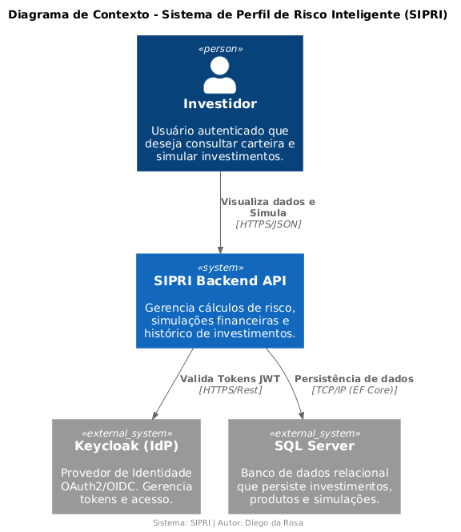
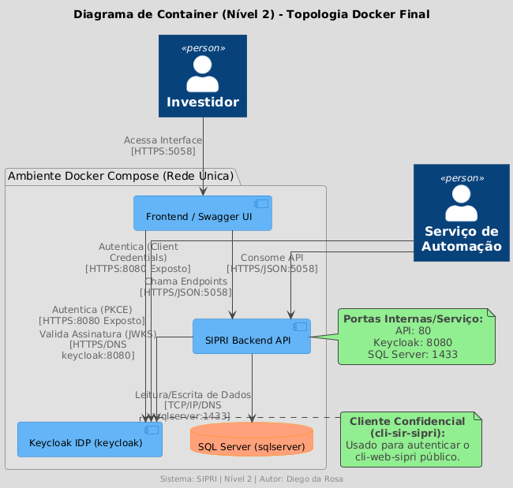
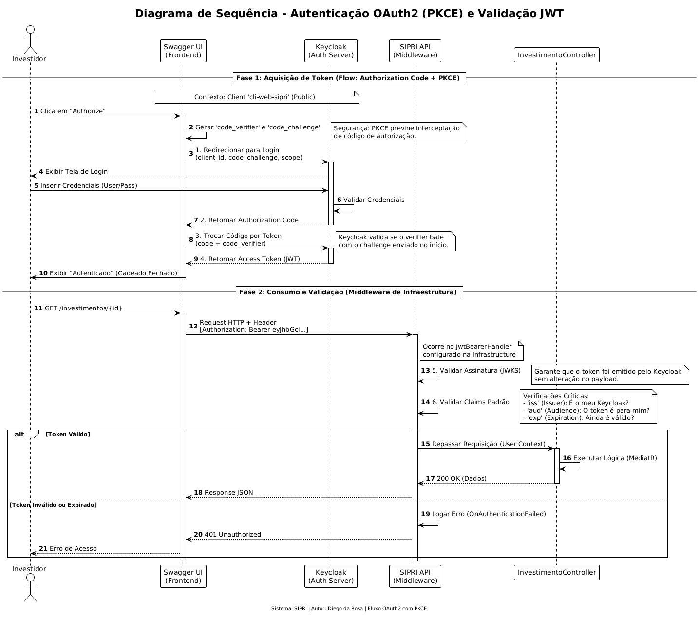
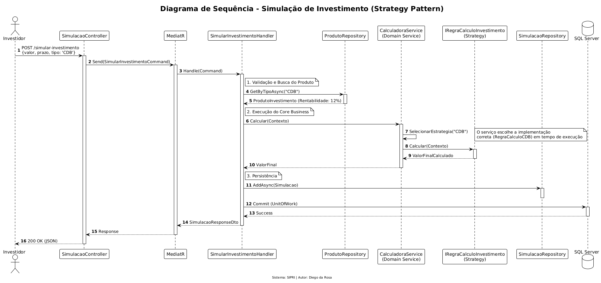
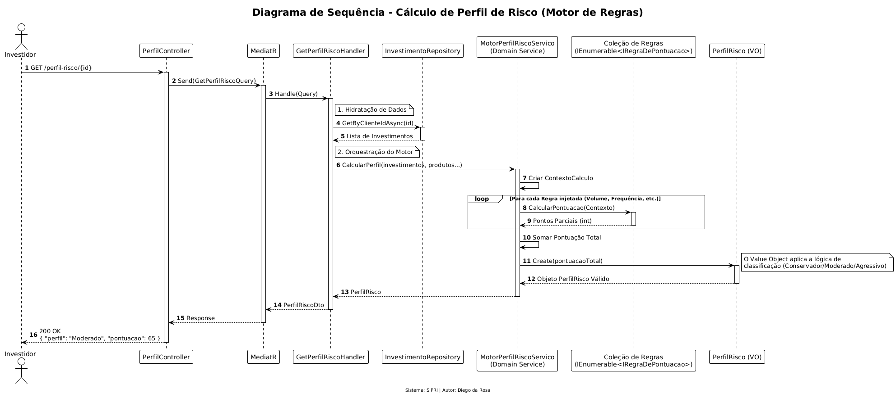
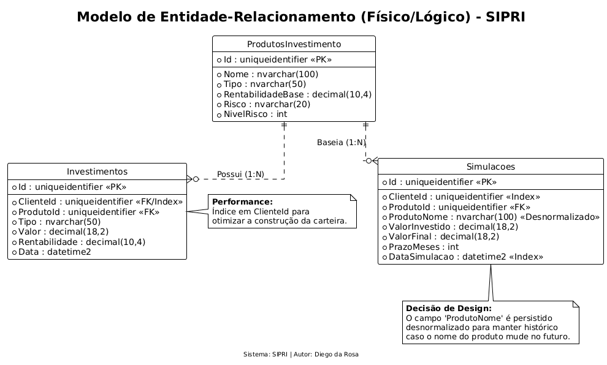

# 🛡️ SIPRI - Sistema de Investimentos e Perfil de Risco Inteligente


---

## 📋 Índice

1. [Visão Geral](#-visão-geral)
2. [🚀 Quick Start](#-quick-start---início-rápido)
3. [Arquitetura](#-arquitetura)
4. [Tecnologias](#-tecnologias)
5. [Documentação Completa](#-documentação-completa)
6. [Estrutura do Projeto](#-estrutura-do-projeto)
7. [Autor](#-autor)

---

## 🎯 Visão Geral

O **SIPRI** é uma API REST robusta e escalável para o setor financeiro, desenvolvida com **Clean Architecture** e **Domain-Driven Design (DDD)**. O sistema oferece:

- ✅ **Simulação de Investimentos** - Cálculo automático de rentabilidade com Strategy Pattern
- ✅ **Perfil de Risco Inteligente** - Motor de regras para classificação de investidores
- ✅ **Recomendação de Produtos** - Sugestões personalizadas por perfil
- ✅ **Gestão de Carteira** - Histórico completo de investimentos
- ✅ **Métricas e Telemetria** - Dados agregados para análise

### 🏆 Diferenciais Técnicos

- **Clean Architecture** - Separação rigorosa em camadas (Domain, Application, Infrastructure, Presentation)
- **CQRS** - Commands e Queries separados com MediatR
- **Strategy Pattern** - Cálculos polimórficos por tipo de produto
- **FluentValidation** - Validação automática via pipeline behavior
- **Result Pattern** - Tratamento de erros sem exceções desnecessárias
- **RFC 7807** - Respostas de erro padronizadas (Problem Details)
- **OAuth2/OIDC** - Autenticação segura com Keycloak e JWT
- **Docker Compose** - Deploy simplificado e reproduzível

---

## 🚀 Quick Start - Início Rápido

### ⚡ Pré-requisitos

- **Docker** e **Docker Compose** instalados
- Portas disponíveis: **5058**, **8080**, **1433**

### 📦 Executar o Projeto

```bash
# 1. Clone o repositório
git clone https://github.com/seu-usuario/sipri.git
cd sipri

# 2. Inicie todos os serviços com Docker Compose
docker-compose up --build -d

# 3. Aguarde ~30 segundos para inicialização completa
```

### 🌐 Serviços e Portas

| Serviço        | Tecnologia      | Porta Interna | Porta Externa | URL de Acesso         |
| -------------- | --------------- | ------------- | ------------- | --------------------- |
| **SIPRI API**  | ASP.NET Core 8  | 80            | **5058**      | http://localhost:5058 |
| **Keycloak**   | Keycloak 26.4.5 | 8080          | **8080**      | http://localhost:8080 |
| **SQL Server** | SQL Server 2022 | 1433          | **1433**      | localhost:1433        |

---

## 🔐 Acessar a API via Swagger

### 1️⃣ Abrir Swagger UI

Acesse: **http://localhost:5058/swagger/index.html**

### 2️⃣ Autenticar no Keycloak

1. Clique no botão **"Authorize"** (cadeado no topo direito)
2. Na janela que abrir, clique novamente em **"Authorize"**
3. Você será redirecionado para o Keycloak
4. **Faça login com as credenciais padrão:**
   - **Username:** `user`
   - **Password:** `user`
5. Após login, você será redirecionado de volta ao Swagger
6. O cadeado ficará **fechado** ✅ indicando que você está autenticado

### 3️⃣ Testar os Endpoints

Agora você pode expandir qualquer endpoint e clicar em **"Try it out"** para testá-lo!

---

## 👥 Gerenciar Usuários (Opcional)

Se precisar criar mais usuários ou ajustar permissões:

1. Acesse o **Painel Admin do Keycloak:** http://localhost:8080/admin
2. **Credenciais de Admin:**
   - **Username:** `admin`
   - **Password:** `admin`
3. Navegue para: **Realm: sipri-realm** → **Users** → **Add User**

---

## 📖 Casos de Uso e Testes

Para exemplos detalhados de **requisições e respostas** de todos os endpoints:

👉 **[Documentação de Casos de Uso](documentacao/casos-de-uso-e-testes/casos-de-uso-e-testes.md)**

Inclui:

- ✅ Exemplos de entrada (JSON)
- ✅ Exemplos de saída esperada
- ✅ Códigos de erro e validações
- ✅ Comandos cURL prontos para uso

---

## 🏗️ Arquitetura

### Diagrama de Contexto (C4 - Nível 1)



**Atores e Sistemas:**

- **Investidor** - Usuário autenticado que consome a API
- **SIPRI Backend** - Sistema principal (esta aplicação)
- **Keycloak** - Provedor de identidade OAuth2/OIDC
- **SQL Server** - Banco de dados relacional

---

### Diagrama de Container (C4 - Nível 2)



**Topologia Docker:**

- **Frontend/Swagger** → **Keycloak** (autenticação PKCE)
- **Swagger** → **SIPRI API** (Bearer Token JWT)
- **SIPRI API** → **Keycloak** (validação de assinatura)
- **SIPRI API** → **SQL Server** (persistência via EF Core)

---

### Fluxos de Negócio

#### Autenticação OAuth2 com PKCE



#### Simulação de Investimento (Strategy Pattern)



#### Cálculo de Perfil de Risco (Motor de Regras)



---

### Modelo de Dados (DER)



**Entidades Principais:**

- `ProdutoInvestimento` - Catálogo de produtos (CDB, Fundos, LCI, etc.)
- `Investimento` - Investimentos realizados
- `Simulacao` - Histórico de simulações
- `Cliente` - Gerenciado pelo Keycloak

---

## 🚀 Tecnologias

### Backend & Framework

- **.NET 8.0** - Framework moderno e performático
- **ASP.NET Core** - Web API RESTful
- **C# 12** - Linguagem de programação

### Arquitetura & Padrões

- **Clean Architecture** - Separação em camadas
- **CQRS** - Command Query Responsibility Segregation
- **DDD** - Domain-Driven Design
- **Strategy Pattern** - Cálculos polimórficos
- **Repository Pattern** - Abstração de dados
- **Unit of Work** - Transações consistentes

### Bibliotecas & Ferramentas

- **MediatR** - Mediação CQRS
- **FluentValidation** - Validação declarativa
- **Entity Framework Core** - ORM
- **AutoMapper/Mapster** - Mapeamento de objetos

### Segurança & Autenticação

- **Keycloak** - Identity Provider (OAuth2/OIDC)
- **JWT** - JSON Web Tokens
- **PKCE** - Proof Key for Code Exchange

### Infraestrutura

- **Docker & Docker Compose** - Containerização
- **SQL Server 2022** - Banco de dados relacional
- **Swagger/OpenAPI** - Documentação interativa

### Testes

- **xUnit** - Framework de testes
- **Moq** - Mocking
- **FluentAssertions** - Assertions fluentes

---

## 📚 Documentação Completa

Este projeto é **extremamente bem documentado**. Explore toda a documentação disponível:

### 📘 Guias Principais

| Documento                                                                                | Descrição                                                   |
| ---------------------------------------------------------------------------------------- | ----------------------------------------------------------- |
| **[Casos de Uso e Testes](documentacao/casos-de-uso-e-testes/casos-de-uso-e-testes.md)** | Exemplos práticos de todos os endpoints com entrada/saída   |
| **[Guia de Autenticação](documentacao/autenticacao/autenticacao.md)**                    | Tutorial completo OAuth2, JWT, Keycloak e troubleshooting   |
| **[Arquitetura do Sistema](documentacao/arquitetura/arquitetura.md)**                    | Visão detalhada da arquitetura, padrões e decisões técnicas |

### 🎨 Diagramas

Todos os diagramas estão em: **[documentacao/arquitetura/diagramas/](documentacao/arquitetura/diagramas/)**

- Diagrama de Contexto (Nível 1)
- Diagrama de Container (Nível 2)
- Diagrama de Sequência - Autenticação
- Diagrama de Sequência - Simulação de Investimento
- Diagrama de Sequência - Cálculo de Perfil de Risco
- Diagrama Entidade-Relacionamento (DER)

### 🌐 Documentação Interativa

- **Swagger UI:** http://localhost:5058/swagger
- **Keycloak Admin:** http://localhost:8080/admin

---

## 🏛️ Estrutura do Projeto

```
SIPRI/
├── src/
│   ├── SIPRI.Domain/              # 🧠 Camada de Domínio
│   │   ├── Entities/              # Entidades de negócio
│   │   ├── ValueObjects/          # Objetos de valor
│   │   ├── Interfaces/            # Contratos de repositórios
│   │   └── Services/              # Serviços de domínio
│   │
│   ├── SIPRI.Application/         # 📋 Camada de Aplicação
│   │   ├── Commands/              # Commands (CQRS)
│   │   ├── Queries/               # Queries (CQRS)
│   │   ├── Handlers/              # Handlers MediatR
│   │   ├── Validators/            # FluentValidation
│   │   ├── Behaviors/             # Pipeline behaviors
│   │   └── DTOs/                  # Data Transfer Objects
│   │
│   ├── SIPRI.Infrastructure/      # 🔧 Camada de Infraestrutura
│   │   ├── Persistence/           # EF Core, DbContext
│   │   ├── Repositories/          # Implementações de repositórios
│   │   └── Services/              # Serviços de infraestrutura
│   │
│   ├── SIPRI.Presentation/        # 🌐 Camada de Apresentação
│   │   ├── Controllers/           # API Controllers
│   │   └── Middlewares/           # Exception handling
│   │
│   └── SIPRI.Host/                # 🚀 Startup & Configuração
│       ├── Program.cs
│       ├── appsettings.json
│       └── Dockerfile
│
├── tests/                         # 🧪 Testes Automatizados
│   ├── SIPRI.Domain.Tests/
│   ├── SIPRI.Application.Tests/
│   ├── SIPRI.Infrastructure.Tests/
│   └── SIPRI.Presentation.Tests/
│
├── documentacao/                  # 📖 Documentação
│   ├── arquitetura/               # Documentação arquitetural
│   │   └── diagramas/             # Diagramas C4 e UML
│   ├── autenticacao/              # Guia de autenticação
│   └── casos-de-uso-e-testes/     # Exemplos de uso
│
├── docker-compose.yml             # 🐳 Orquestração Docker
├── .env                           # 🔐 Variáveis de ambiente
└── README.md                      # 📄 Este arquivo
```

---

## 🧪 Executar Testes

```bash
# Todos os testes
dotnet test

# Testes por camada
dotnet test tests/SIPRI.Domain.Tests
dotnet test tests/SIPRI.Application.Tests
dotnet test tests/SIPRI.Infrastructure.Tests
dotnet test tests/SIPRI.Presentation.Tests

# Com cobertura
dotnet test --collect:"XPlat Code Coverage"
```

---

## ⚙️ Desenvolvimento Local (Sem Docker)

```bash
# 1. Restaurar dependências
dotnet restore

# 2. Configurar appsettings.Development.json
# (ajustar connection string e URLs do Keycloak)

# 3. Aplicar migrations
dotnet ef database update --project src/SIPRI.Infrastructure --startup-project src/SIPRI.Host

# 4. Executar API
cd src/SIPRI.Host
dotnet run

# Acessar: http://localhost:5058/swagger
```

---

## 🔒 Segurança e Configuração Inicial

> ⚠️ **IMPORTANTE PARA AVALIADORES:**
>
> Os arquivos `.env` e `keycloak-data/realm-export.json` foram **intencionalmente incluídos no repositório** para facilitar a execução inicial do projeto pelo avaliador.
>
> **Em um ambiente de produção real:**
>
> - ✅ O arquivo `.env` estaria no `.gitignore`
> - ✅ Secrets seriam gerenciados via Azure Key Vault, AWS Secrets Manager, etc.
> - ✅ O realm do Keycloak seria configurado via IaC (Terraform/Ansible)
>
> Esta configuração inicial visa **simplificar a avaliação** e permitir que o projeto seja executado com um único comando (`docker-compose up`).

---

## 📊 Endpoints Principais

| Método | Endpoint                          | Descrição                                        |
| ------ | --------------------------------- | ------------------------------------------------ |
| `POST` | `/simular-investimento`           | Simula investimento com cálculo de rentabilidade |
| `GET`  | `/perfil-risco/{clienteId}`       | Calcula perfil de risco do cliente               |
| `GET`  | `/produtos-recomendados/{perfil}` | Lista produtos por perfil de risco               |
| `GET`  | `/simulacoes?clienteId={id}`      | Histórico de simulações                          |
| `GET`  | `/investimentos/{clienteId}`      | Carteira de investimentos                        |
| `GET`  | `/telemetria`                     | Métricas da API                                  |

> 📖 **Documentação Completa:** [Casos de Uso](documentacao/casos-de-uso-e-testes/casos-de-uso-e-testes.md)

---

## 🎯 Decisões Arquiteturais (ADRs)

| Decisão                | Justificativa                                       | Benefício                                    |
| ---------------------- | --------------------------------------------------- | -------------------------------------------- |
| **Strategy Pattern**   | Cálculos de risco e investimento variam por produto | Extensibilidade (OCP) e isolamento de regras |
| **CQRS**               | Separação de Commands e Queries                     | Testabilidade e escalabilidade independente  |
| **Clean Architecture** | Domínio isolado de infraestrutura                   | Manutenibilidade e proteção do core business |
| **FluentValidation**   | Validação declarativa e reutilizável                | Código limpo e validações centralizadas      |
| **RFC 7807**           | Respostas de erro padronizadas                      | Consumo programático consistente             |

---

## 👨‍💻 Autor

**Diego da Rosa**  
Engenheiro de Software Backend  
Especialista em Clean Architecture, DDD e .NET

---

## 📄 Licença

Este projeto é proprietário e confidencial.

---

## 🙏 Agradecimentos

Desenvolvido como parte do desafio técnico, demonstrando aplicação prática de:

- Clean Architecture
- Domain-Driven Design
- CQRS Pattern
- OAuth2/OIDC
- Docker & Microservices

---

<div align="center">

**⭐ Se este projeto foi útil, considere dar uma estrela! ⭐**

</div>
